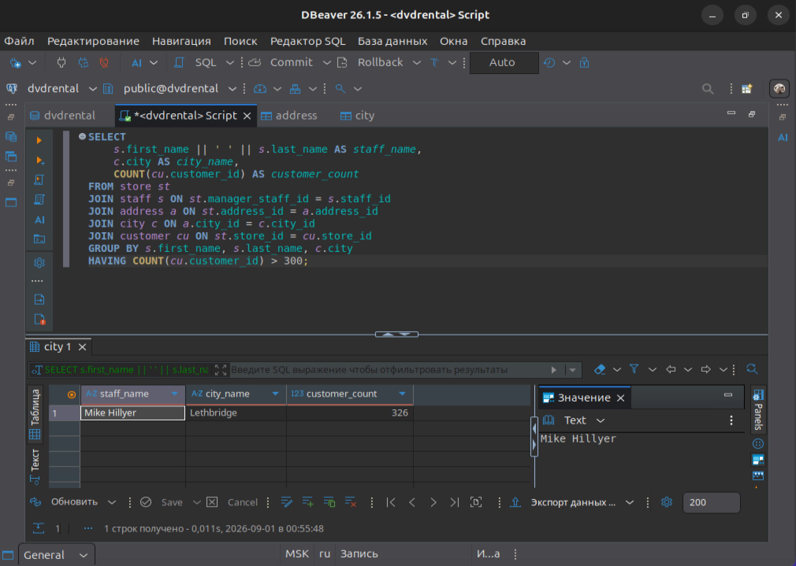
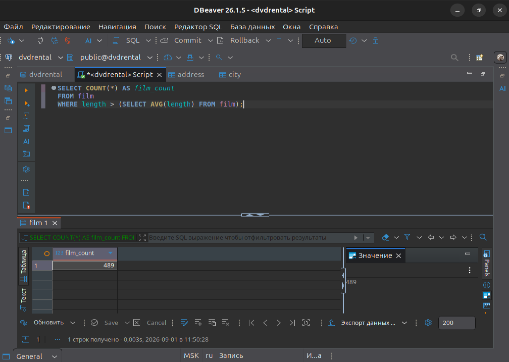
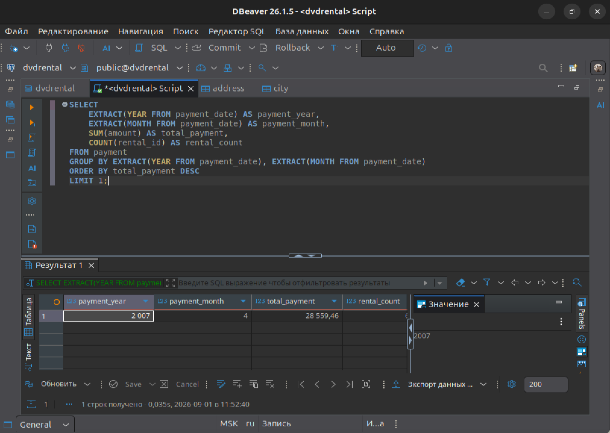

# Домашнее задание к занятию "SQL. Часть 2". Ярмощук Павел

## Задание 1
Одним запросом получите информацию о магазине, в котором обслуживается более 300 покупателей, и выведите в результат следующую информацию:

фамилия и имя сотрудника из этого магазина;
город нахождения магазина;
количество пользователей, закреплённых в этом магазине.

### Решение 1
sql

SELECT
    s.first_name || ' ' || s.last_name AS staff_name,
    c.city AS city_name,
    COUNT(cu.customer_id) AS customer_count
FROM store st
JOIN staff s ON st.manager_staff_id = s.staff_id
JOIN address a ON st.address_id = a.address_id
JOIN city c ON a.city_id = c.city_id
JOIN customer cu ON st.store_id = cu.store_id
GROUP BY s.first_name, s.last_name, c.city
HAVING COUNT(cu.customer_id) > 300;

## Задание 2
Получите количество фильмов, продолжительность которых больше средней продолжительности всех фильмов.

### Решение 2
sql

SELECT COUNT(*) AS film_count
FROM film
WHERE length > (SELECT AVG(length) FROM film);

## Задание 3
Получите информацию, за какой месяц была получена наибольшая сумма платежей, и добавьте информацию по количеству аренд за этот месяц.

### Решение 3
sql

SELECT
    EXTRACT(YEAR FROM payment_date) AS payment_year,
    EXTRACT(MONTH FROM payment_date) AS payment_month,
    SUM(amount) AS total_payment,
    COUNT(rental_id) AS rental_count
FROM payment
GROUP BY EXTRACT(YEAR FROM payment_date), EXTRACT(MONTH FROM payment_date)
ORDER BY total_payment DESC
LIMIT 1;

