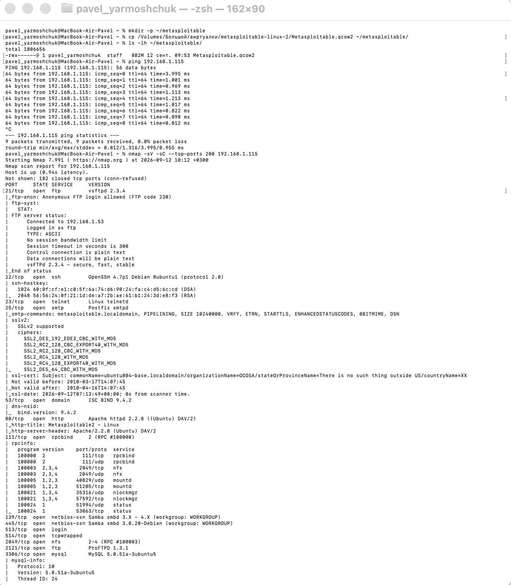
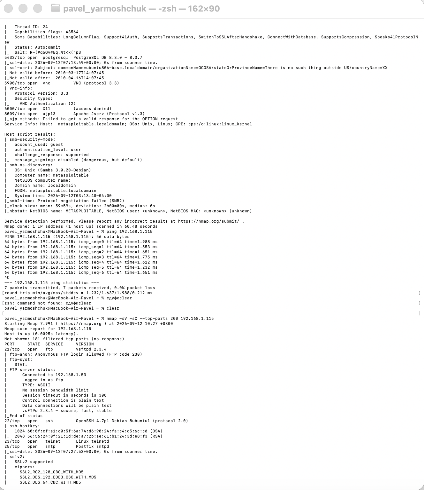
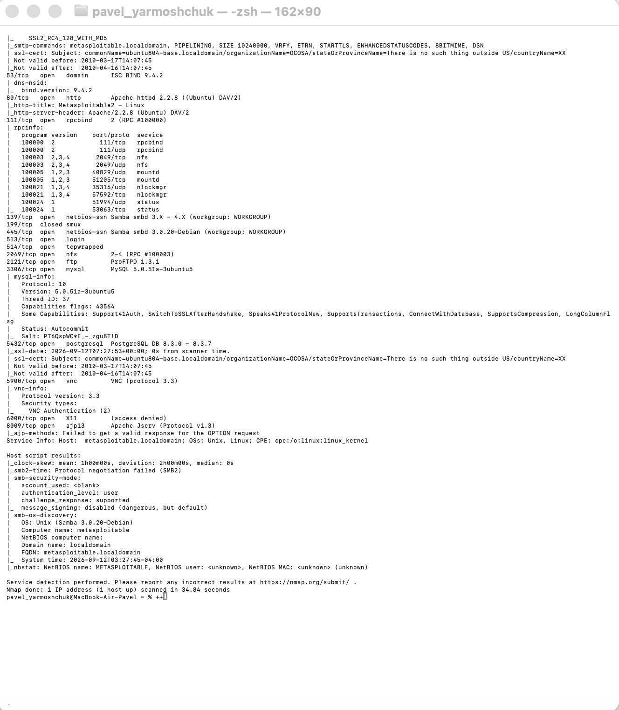
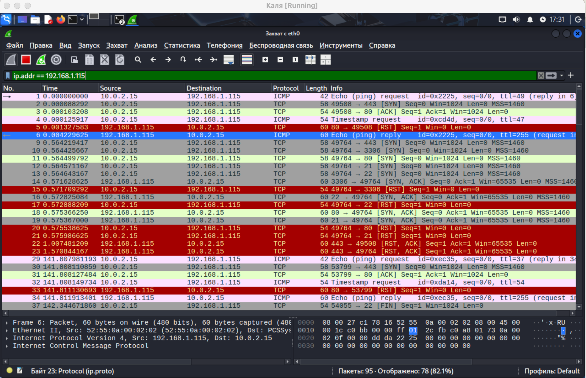
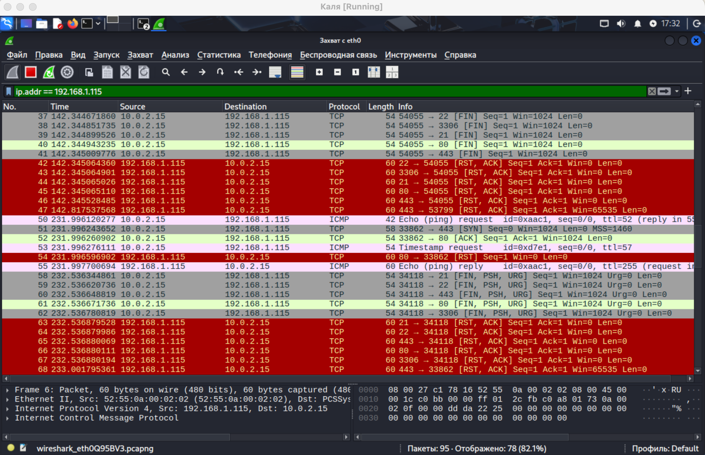
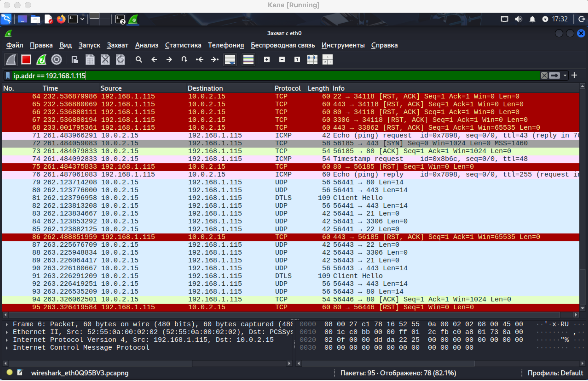

# Домашнее задание к занятию "Уязвимости и атаки на информационные системы". Ярмощук Павел

## Задание 1
Скачайте и установите виртуальную машину Metasploitable: https://sourceforge.net/projects/metasploitable/.
Это типовая ОС для экспериментов в области информационной безопасности, с которой следует начать при анализе уязвимостей.
Просканируйте эту виртуальную машину, используя nmap.
Попробуйте найти уязвимости, которым подвержена эта виртуальная машина.
Сами уязвимости можно поискать на сайте https://www.exploit-db.com/.
Для этого нужно в поиске ввести название сетевой службы, обнаруженной на атакуемой машине, и выбрать подходящие по версии уязвимости.
Ответьте на следующие вопросы:
- Какие сетевые службы в ней разрешены?
- Какие уязвимости были вами обнаружены? (список со ссылками: достаточно трёх уязвимостей)
Приведите ответ в свободной форме.

### Решение 1
Для выполнения задания была развёрнута виртуальная машина Metasploitable 2 (Linux, Ubuntu 8.04, ядро 2.6.24). Сканирование проводилось с хоста MacBook Air (M1) с помощью Nmap 7.99 командой:

bash
nmap -sV -sC --top-ports 200 192.168.1.115

В результате сканирования обнаружено 18 открытых TCP-портов.
Рандомно выбраны следующие 3 уязвимости и проверены в ExploitDB:
1. vsftpd 2.3.4 — Backdoor Command Execution
Порт: 21/tcp
Тип: удалённое выполнение команд (RCE)
CVE: CVE-2011-2523
EDB-ID: 17491
Ссылка: https://www.exploit-db.com/exploits/17491
В версии vsftpd 2.3.4 в исходный код был внедрён бэкдор. При вводе имени пользователя, содержащего последовательность :), на порту 6200 открывается командная оболочка с правами root. Это критическая уязвимость, позволяющая полностью захватить сервер.
2. Samba smbd 3.0.20 — Username Map Script Command Execution
Порт: 445/tcp
Тип: удалённое выполнение команд (RCE)
CVE: CVE-2007-2447
EDB-ID: 16320
Ссылка: https://www.exploit-db.com/exploits/16320
Уязвимость в Samba связана с обработкой параметра username map script. Злоумышленник может передать специально сформированную строку имени пользователя, которая будет выполнена как команда оболочки. Позволяет выполнить произвольные команды на сервере.
3. ProFTPD 1.3.1 — SQL Injection / Remote Code Execution
Порт: 2121/tcp
Тип: SQL-инъекция с последующим выполнением команд
CVE: CVE-2009-0542
EDB-ID: 16851
Ссылка: https://www.exploit-db.com/exploits/16851
Уязвимость в модуле mod_sql ProFTPD 1.3.1 позволяет через специально сформированный запрос выполнить произвольный SQL-код. При определённых конфигурациях это приводит к выполнению команд на сервере.

## Задание 2
Проведите сканирование Metasploitable в режимах SYN, FIN, Xmas, UDP.
Запишите сеансы сканирования в Wireshark.
Ответьте на следующие вопросы:
- Чем отличаются эти режимы сканирования с точки зрения сетевого трафика?
- Как отвечает сервер?
Приведите ответ в свободной форме.

### Решение 2
В виртуальной машине Kali Linux был запущен анализатор трафика Wireshark (интерфейс eth0). С помощью Nmap 7.99 было выполнено четыре типа сканирования виртуальной машины Metasploitable 2 (IP-адрес 192.168.1.115). Трафик каждого сеанса записывался в Wireshark и анализировался с фильтром ip.addr == 192.168.1.115.
При SYN-сканировании открытые порты (21, 22, 80) ответили SYN/ACK, закрытые (443, 3306) — RST/ACK. Это классическое поведение TCP.
При FIN и Xmas-сканировании все порты ответили RST/ACK, независимо от состояния. Это объясняется особенностью ядра Linux 2.6.24 в Metasploitable 2 — оно не следует RFC 793 и отвечает RST на любые пакеты без флагов SYN/ACK. Таким образом, на этой системе FIN/Xmas-сканирование не позволяет различить открытые и закрытые порты.
При UDP-сканировании наблюдались UDP-пакеты на целевые порты и ответы от служб. Чётких ICMP Port Unreachable не зафиксировано — вероятно, из-за особенностей отправляемых payload'ов.

