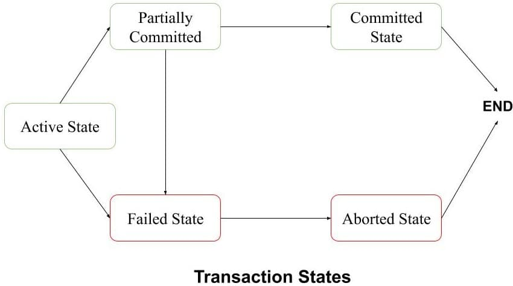
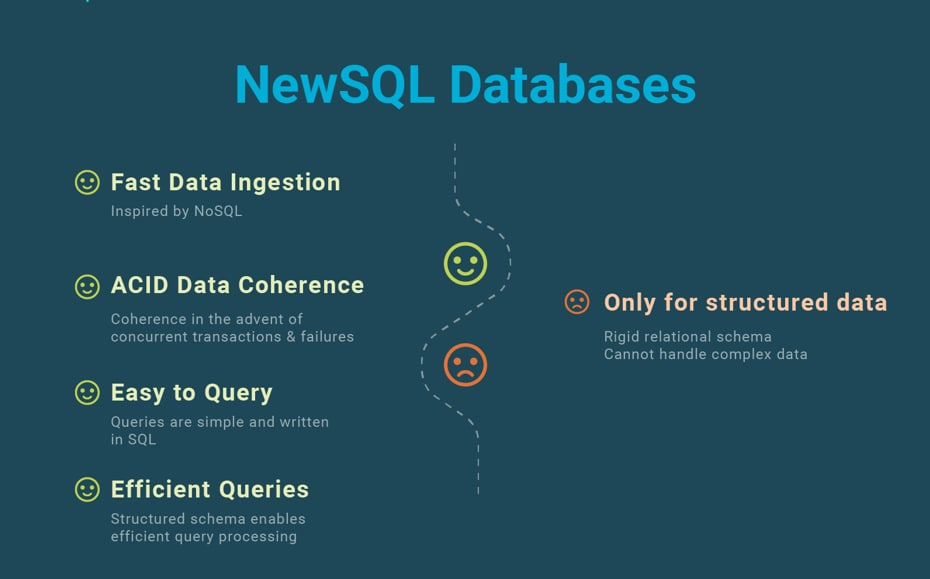

# Домашнее задание "Базы данных, их типы". Ярмощук Павел

# Задание 1. СУБД
Кейс: крупная строительная компания, которая также занимается проектированием и девелопментом, решила создать правильную архитектуру для работы с данными. Ниже представлены задачи, которые необходимо решить для каждой предметной области.

Какие типы СУБД, на ваш взгляд, лучше всего подойдут для решения этих задач и почему?

1.1. Бюджетирование проектов с дальнейшим формированием финансовых аналитических отчётов и прогнозирования рисков. СУБД должна гарантировать целостность и чёткую структуру данных.

1.1.* Хеширование стало занимать длительное время, какое API можно использовать для ускорения работы?

1.2. Под каждый девелоперский проект создаётся отдельный лендинг, и все данные по лидам стекаются в CRM к маркетологам и менеджерам по продажам. Какой тип СУБД лучше использовать для лендингов и для CRM? СУБД должны быть гибкими и быстрыми.

1.3. Отдел контроля качества решил создать базу по корпоративным нормам и правилам, обучающему материалу и так далее, сформированную согласно структуре компании. СУБД должна иметь простую и понятную структуру.

1.4. Департамент логистики нуждается в решении задач по быстрому формированию маршрутов доставки материалов по объектам и распределению курьеров по маршрутам с доставкой документов. СУБД должна уметь быстро работать со связями.

## Решение 1.
1.1 Для бюджетирования проектов, финансовой аналитики и прогнозирования рисков лучше всего подходит реляционная СУБД: PostgreSQL, MySQL, Oracle. Такие системы хорошо работают со строго структурированными данными, обеспечивают целостность, ограничения, транзакции и удобны для отчётности и аналитики.

1.1.* Вместо обычного хеширования можно использовать криптографический API/библиотеку, которая умеет считать хеши быстрее и безопаснее на уровне платформы или приложения, например встроенные средства СУБД или системные библиотеки, а также, при необходимости, аппаратное ускорение.

1.2 Для лендингов лучше подходит документная СУБД: она гибкая, быстро меняется вместе со структурой формы и удобно хранит лиды с разным набором полей. Для CRM тоже часто подходит реляционная СУБД, если важны связи между клиентами, сделками, задачами и менеджерами, но если приоритет — гибкость и скорость разработки, можно использовать и документную модель.

1.3 Для базы корпоративных норм, правил и обучающих материалов лучше подходит иерархическая или реляционная СУБД с простой структурой. Если нужен понятный путь от раздела к подразделу и дальше к документам, удобно хранить структуру через таблицы с parent_id или через дерево документов.

1.4 Для логистики лучше всего подходит графовая СУБД, потому что она быстро работает со связями между объектами, маршрутами, курьерами, точками доставки и зависимостями между ними. Такие базы удобны там, где основной акцент на отношениях и поиске маршрутов.

# Задание 2. Транзакции
2.1. Пользователь пополняет баланс счёта телефона, распишите пошагово, какие действия должны произойти для того, чтобы транзакция завершилась успешно. Ориентируйтесь на шесть действий.

2.1.* Какие действия должны произойти, если пополнение счёта телефона происходило бы через автоплатёж?

## Решение 2.
2.1 При пополнении баланса телефона транзакция проходит следующим образом: сначала система начинает транзакцию, затем проверяет достаточность средств у платёжного источника, после этого резервирует или списывает деньги, потом начисляет сумму на счёт телефона, проверяет корректность всех изменений, и в конце выполняет commit. Если на любом шаге возникает ошибка, то выполняется rollback, чтобы не было частичного списания или начисления.
2.1.* При автоплатеже действия почти те же: система сначала проверяет, что автоплатёж разрешён, лимит не превышен и есть привязанная карта или счёт. Затем выполняется списание, начисление на телефон, фиксация результата и запись в историю автоплатежей; при сбое — откат и повторная попытка по правилам сервиса.

# Задание 3. SQL vs NoSQL
3.1. Напишите пять преимуществ SQL-систем по отношению к NoSQL.

3.1.* Какие, на ваш взгляд, преимущества у NewSQL систем перед SQL и NoSQL.

## Решение 3.
3.1 Пять преимуществ SQL-систем по отношению к NoSQL:
•	Строгая схема данных.
•	Поддержка ACID-транзакций.
•	Удобный и стандартный язык запросов SQL.
•	Хорошая целостность данных через ключи, ограничения и связи.
•	Удобство для отчётности, аналитики и сложных JOIN-запросов.

3.1.* Преимущества NewSQL перед SQL и NoSQL:
•	Сохраняют SQL и ACID, как классические реляционные БД.
•	Масштабируются горизонтально лучше, чем многие традиционные SQL-системы.
•	Дают более высокую согласованность, чем многие NoSQL-системы.
•	Подходят для больших распределённых систем без полного отказа от транзакций.
•	Удобны там, где нужны и масштаб, и строгая целостность.

# Задание 4. Кластеры
Необходимо производить большое количество вычислений при работе с огромным количеством данных, под эту задачу выделено 1000 машин.

На основе какого критерия будете выбирать тип СУБД и какая модель распределённых вычислений здесь справится лучше всего и почему?

## Решение 4.
Для 1000 машин основной ориентир для выбора СУБД — масштабируемость и устойчивость к распределённой обработке, а также характер нагрузки: это аналитика, пакетные вычисления или транзакции. Если задача — обработка больших объёмов данных, лучше всего подойдёт распределённая пакетная модель, например MapReduce, поскольку она хорошо делит вычисления на много узлов, устойчива при сбоях и эффективно работает на кластерах из множества машин.