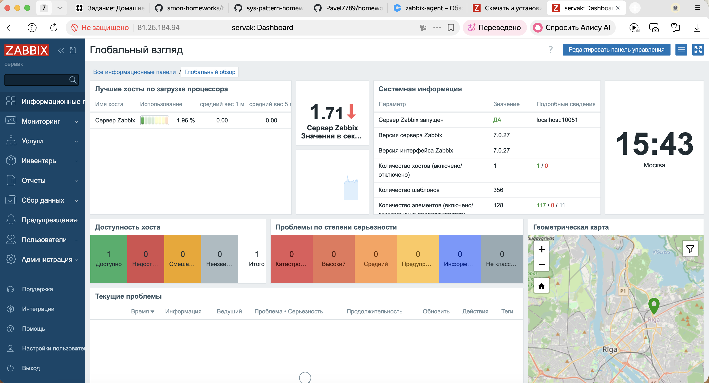
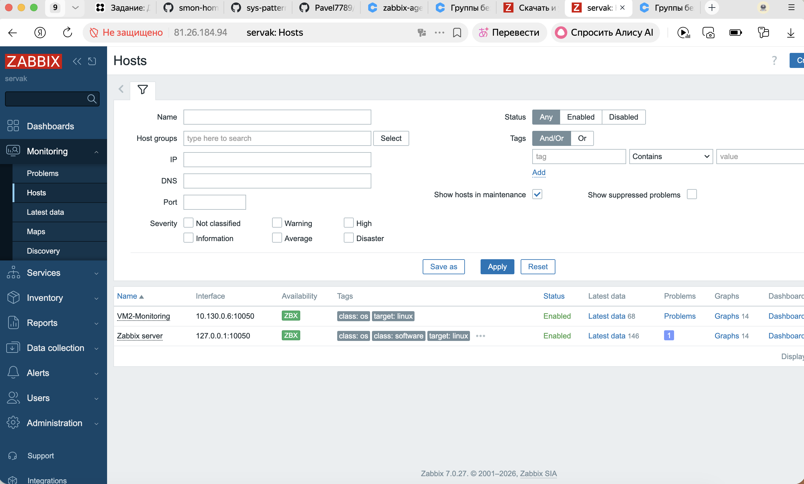
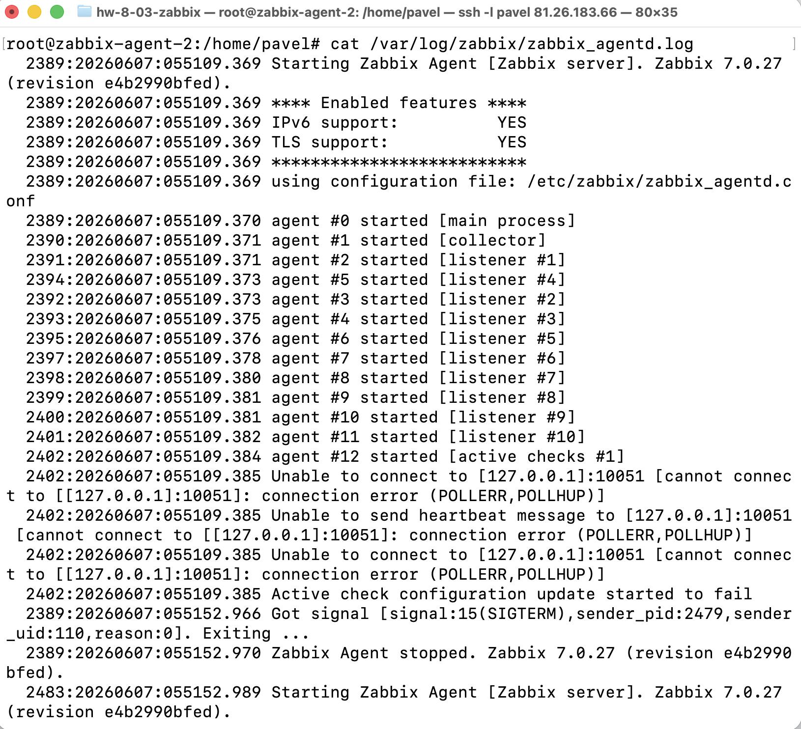
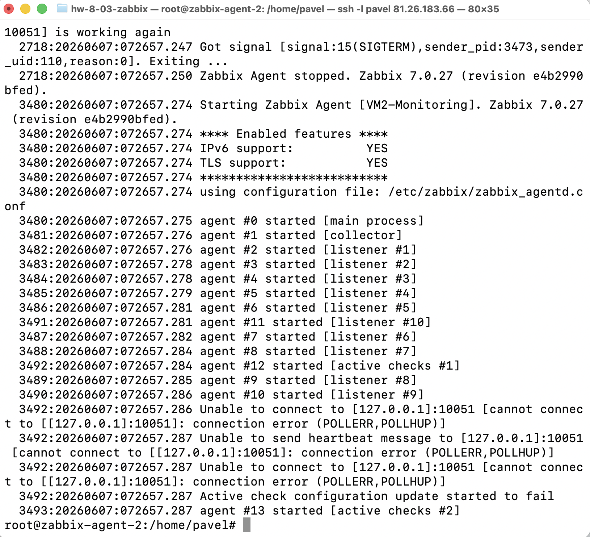
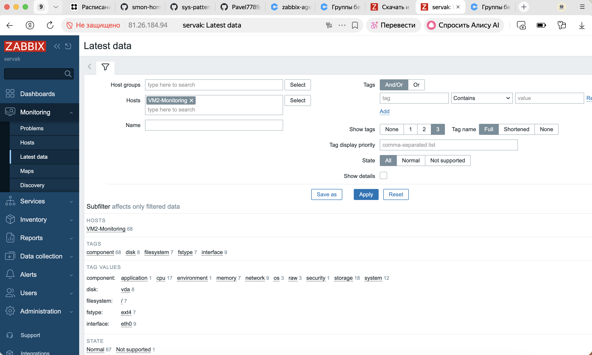
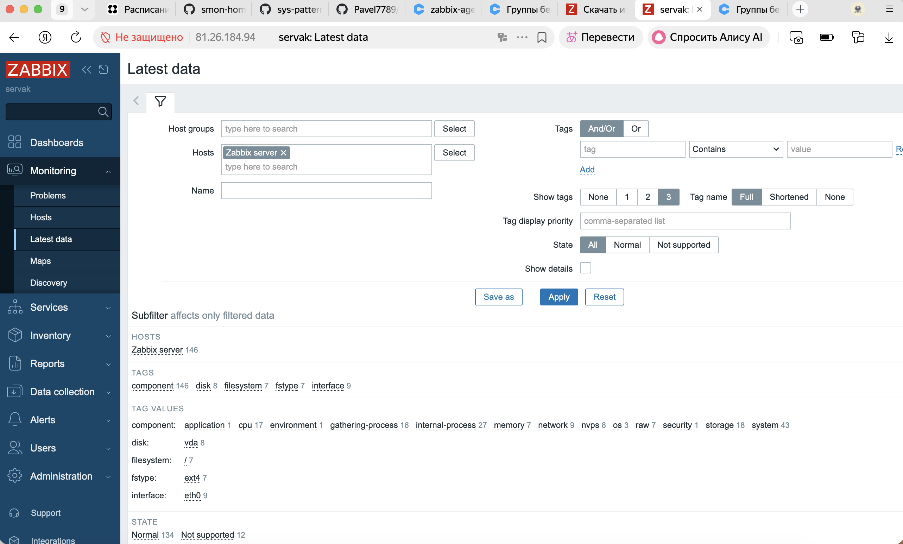

# Домашнее задание "Система мониторинга Zabbix". Ярмощук Павел
VM в Яндекс Облаке:
- VM1 (Zabbix Server): Внешний IP = `81.26.184.94`, Внутренний = `10.130.0.10`
- VM2 (Zabbix Agent): Внешний IP = `81.26.183.66`, Внутренний = `10.130.0.6`

### Использованные команды (на VM1)
sudo -s
apt update && apt upgrade
apt install postgresql -y
wget https://repo.zabbix.com/zabbix/7.0/debian/pool/main/z/zabbix-release/zabbix-release_7.0-1+debian11_all.deb
dpkg -i zabbix-release_7.0-1+debian11_all.deb
apt update
apt install zabbix-server-pgsql zabbix-frontend-php php7.4-pgsql zabbix-apache-conf zabbix-sql-scripts zabbix-agent -y
sudo -u postgres createuser zabbix
sudo -u postgres createdb -O zabbix zabbix
zcat /usr/share/zabbix-sql-scripts/postgresql/server.sql.gz | sudo -u zabbix psql zabbix
systemctl restart zabbix-server zabbix-agent apache2 php7.4-fpm
systemctl enable zabbix-server zabbix-agent apache2 php7.4-fpm

### Использованные команды (на VM2)
sudo -s
apt update && apt upgrade
wget https://repo.zabbix.com/zabbix/7.0/debian/pool/main/z/zabbix-release/zabbix-release_7.0-1+debian11_all.deb
dpkg -i zabbix-release_7.0-1+debian11_all.deb
apt update
apt install zabbix-agent
nano /etc/zabbix/zabbix_agentd.conf
# Server=10.130.0.10
# ServerActive=10.130.0.10
systemctl restart zabbix-agent
systemctl enable zabbix-agent
systemctl status zabbix-agent
journalctl -u zabbix-agent -n 20

### Скрины к заданию

