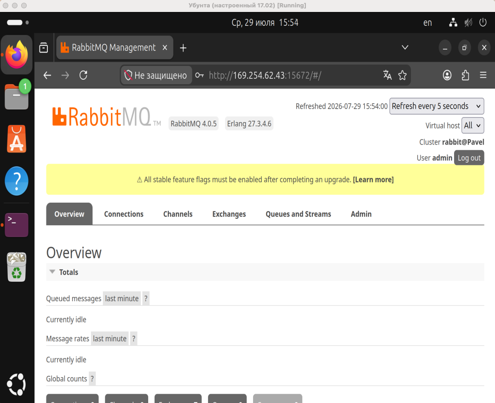
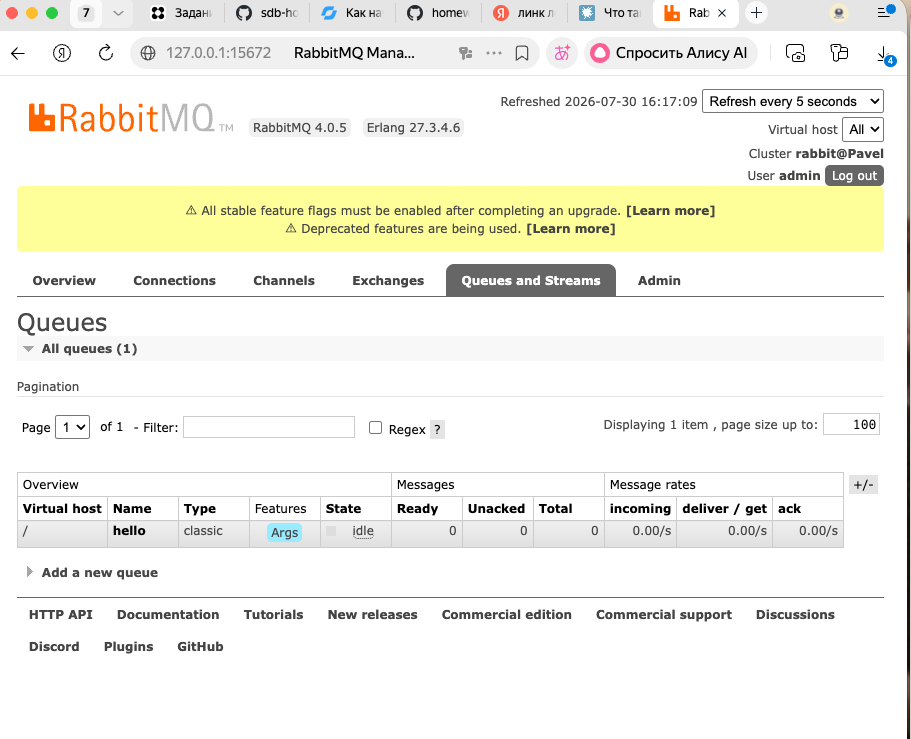
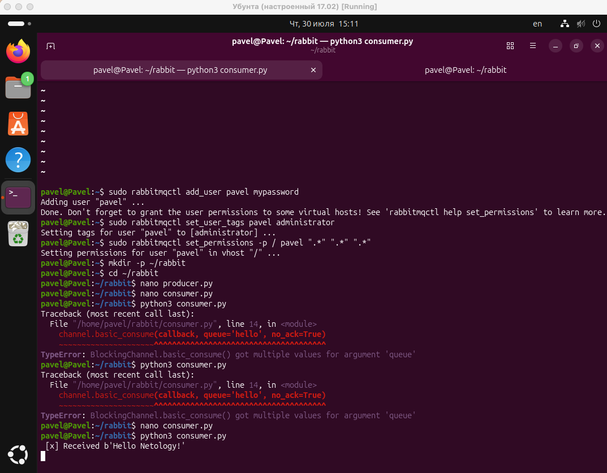
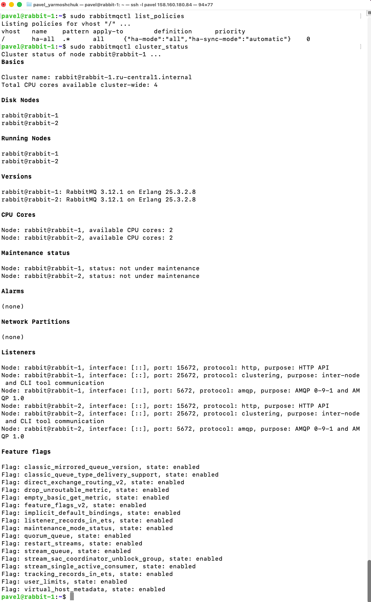
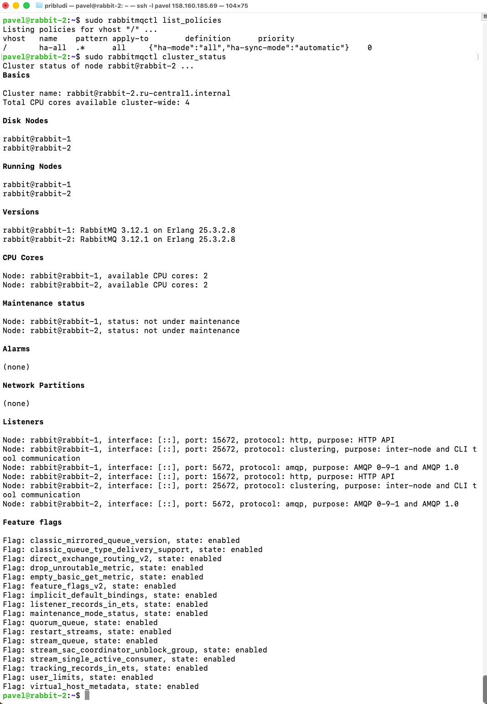
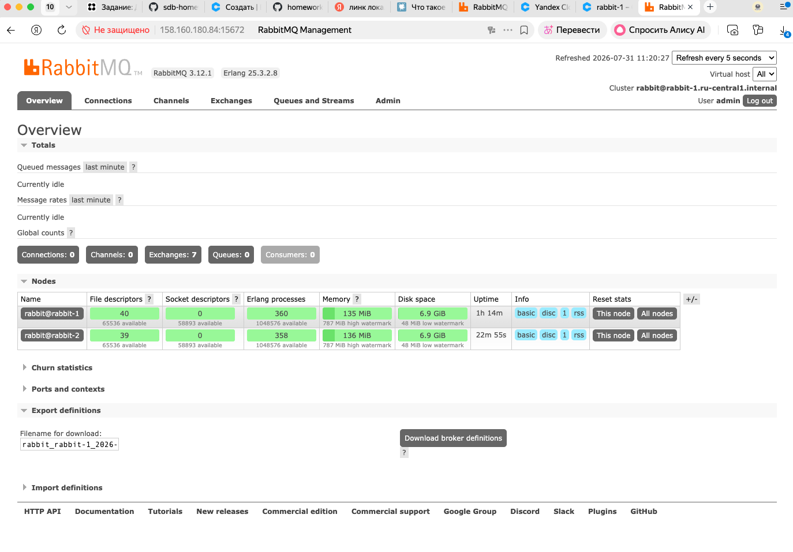
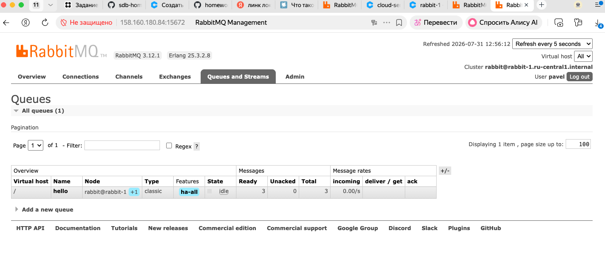
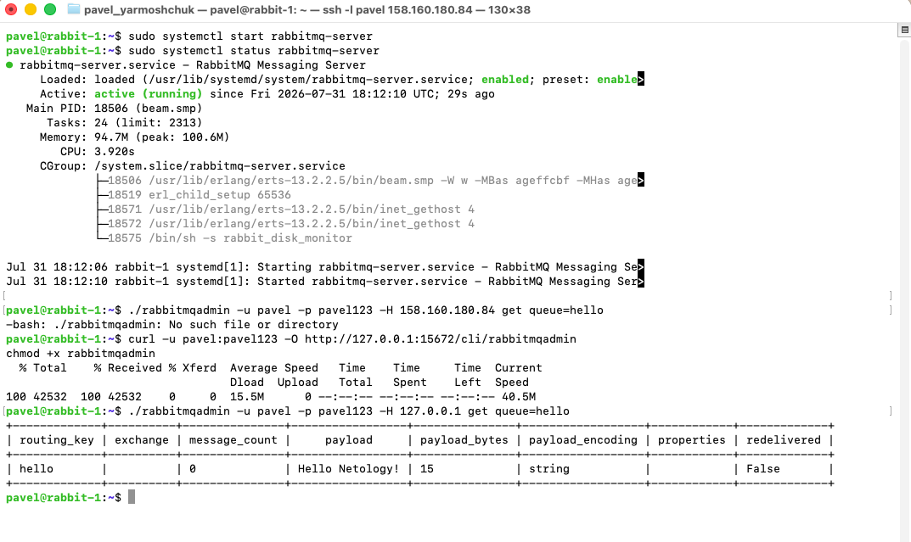
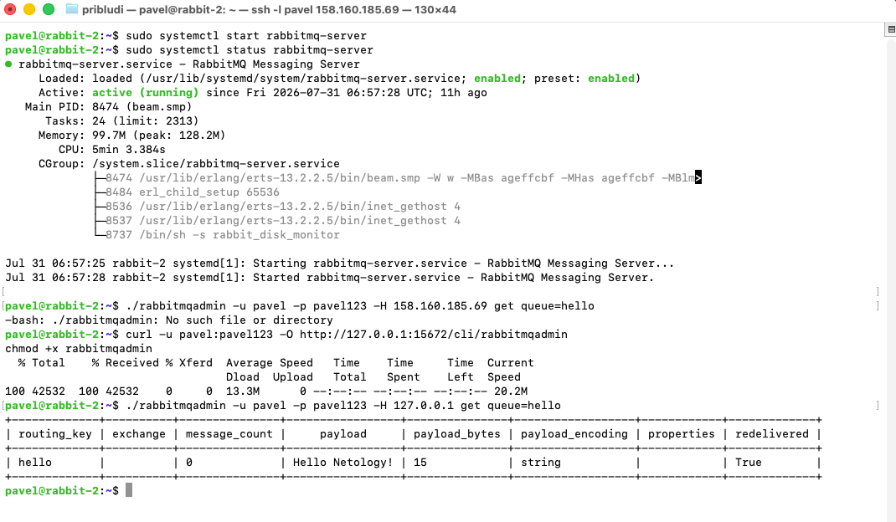
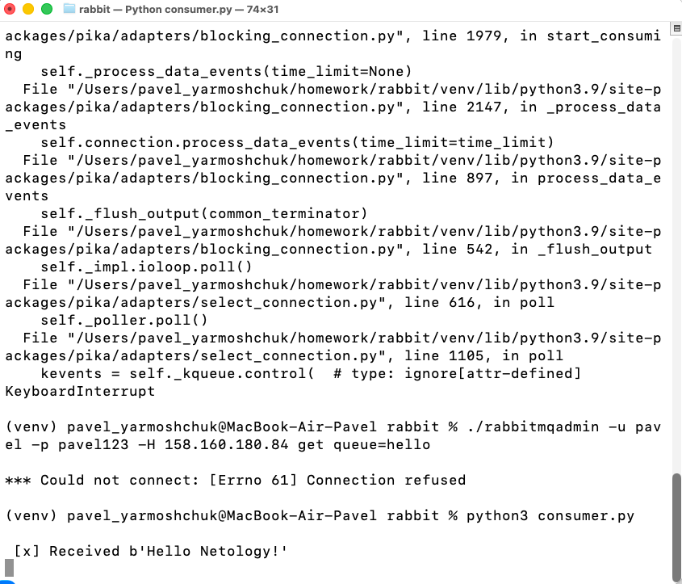

# Домашнее задание к занятию "Очереди RabbitMQ". Ярмощук Павел
# Задание 1. Установка RabbitMQ
## Решение 1.

# Задание 2. Отправка и получение сообщений
## Решение 2.

# Задание 3. Подготовка HA кластера
## Решение 3.

