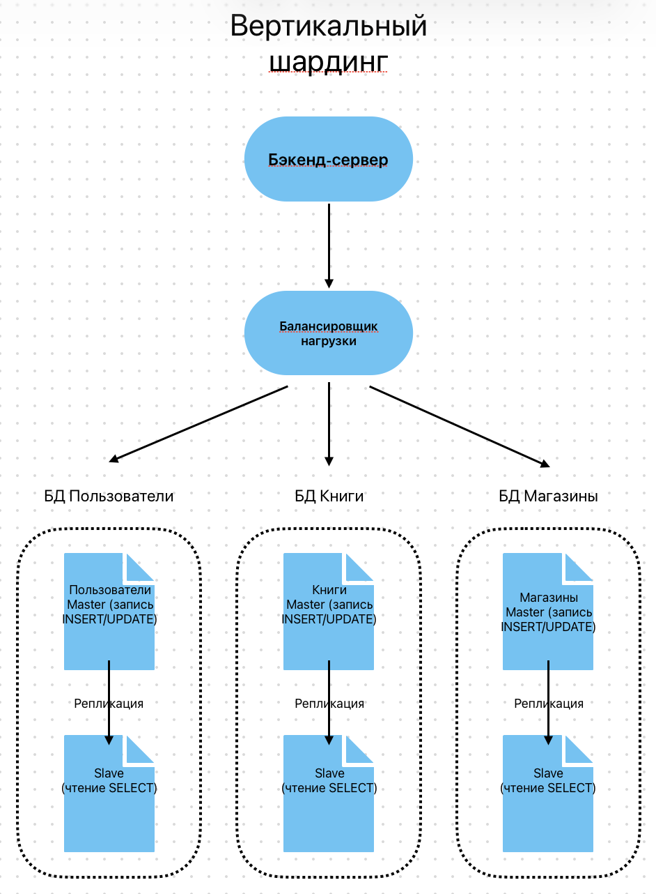
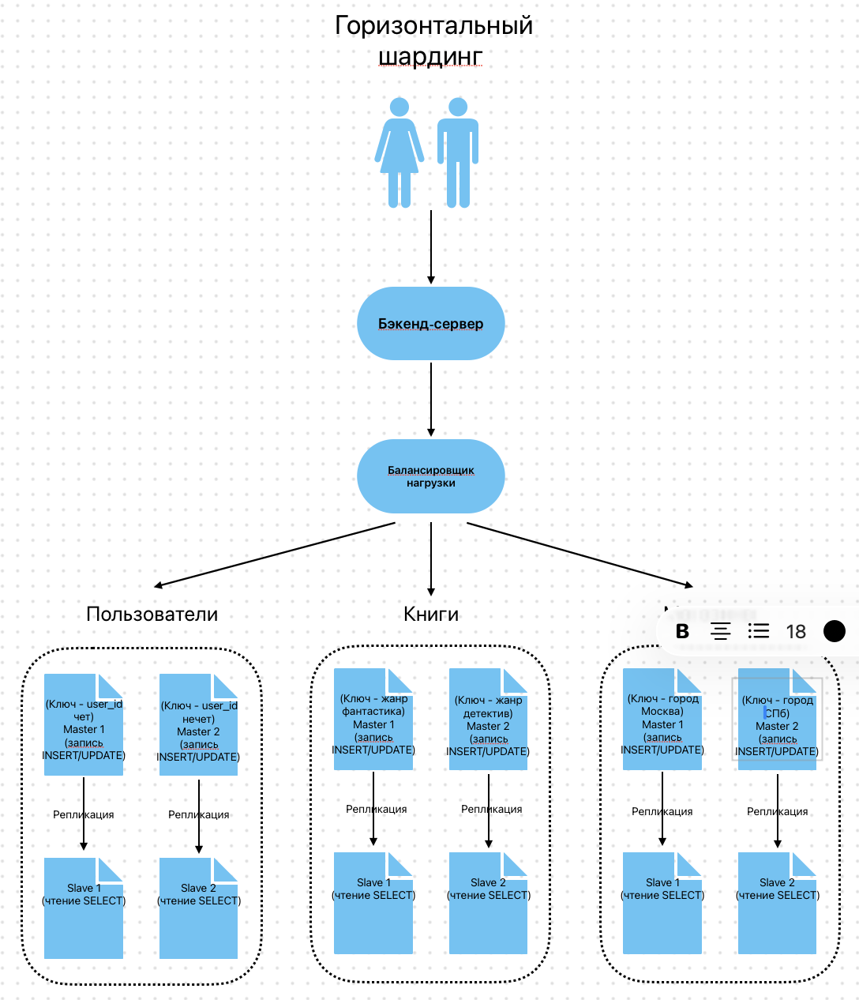

# Домашнее задание к занятию "Репликация и масшабирование. Часть 2". Ярмощук Павел

## Задание 1
Опишите основные преимущества использования масштабирования методами:
активный master-сервер и пассивный репликационный slave-сервер;
master-сервер и несколько slave-серверов;
Дайте ответ в свободной форме.

### Решение 1
**1. Активный master-сервер и пассивный репликационный slave-сервер:**

*   **Отказоустойчивость:** Основное преимущество. Если master выйдет из строя, то можно быстро переключить трафик на slave. Система не потеряет данные, так как они реплицируются в реальном времени.
*   **Резервное копирование:** Slave может использоваться для создания резервных копий без нагрузки на основной сервер. Это позволяет делать бэкапы без остановки работы системы.
*   **Простота:** Схема проста в настройке и обслуживании. Нагрузка на master остается, но данные защищены от потери.

**2. Master-сервер и несколько slave-серверов:**

*   **Масштабирование чтения** Основное преимущество — распределение нагрузки на чтение. База данных часто используется для чтения (SELECT), поэтому можно направить все запросы на чтение на несколько slave-серверов, а на master оставить только запись (INSERT/UPDATE/DELETE).
*   **Снижение нагрузки на master:** Так как slave-серверы обрабатывают большую часть запросов, master испытывает меньшую нагрузку, что увеличивает его производительность при записи.
*   **Гибкость:** Позволяет масштабировать систему горизонтально при росте количества пользователей (например, добавлять новые slave-серверы), не меняя архитектуру.
*   **Географическое распределение:** Можно размещать slave-серверы в разных дата-центрах для ускорения доступа пользователей из разных регионов.

**Недостаток:** В обоих случаях (особенно при пассивном slave) существует задержка репликации , из-за чего данные на slave могут быть неактуальными в течение долей секунды (проблема консистентности). Также запись всегда ограничена возможностями одного master-сервера.

## Задание 2
Разработайте план для выполнения горизонтального и вертикального шардинга базы данных. База данных состоит из трёх таблиц:
пользователи, книги, магазины (столбцы произвольно).
Опишите принципы построения системы и их разграничение или разбивку между базами данных.
Пришлите блоксхему, где и что будет располагаться. Опишите, в каких режимах будут работать сервера.

### Решение 2
**Вертикальный шардинг** - разделение таблиц по разным базам данных (кластерам).

Режимы работы серверов
- Master — принимает запросы на запись (INSERT, UPDATE, DELETE).
- Slave — принимает запросы на чтение (SELECT), реплицируется от Master.
- Балансировщик — направляет запросы в нужную БД по типу данных.

**Горизонтальный шардинг** — разделение данных внутри одной таблицы на несколько серверов.

- Пользователи делятся по `user_id` (чётные/нечётные)
- Книги делятся по `жанру` (фантастика/детективы)
- Магазины делятся по `городу` (Москва/СПб)

Режимы работы серверов
- Master — принимает запросы на запись (INSERT, UPDATE, DELETE)
- Slave — принимает запросы на чтение (SELECT), реплицируется от Master
- Балансировщик — направляет запросы на нужный шард по ключу