# Домашнее задание к занятию "Защита сети". Ярмощук Павел

## Задание 1
Проведите разведку системы и определите, какие сетевые службы запущены на защищаемой системе:
- sudo nmap -sA < ip-адрес >
- sudo nmap -sT < ip-адрес >
- sudo nmap -sS < ip-адрес >
- sudo nmap -sV < ip-адрес >
По желанию можете поэкспериментировать с опциями: https://nmap.org/man/ru/man-briefoptions.html.
В качестве ответа пришлите события, которые попали в логи Suricata и Fail2Ban, прокомментируйте результат.

### Решение 1
**Защищаемая система:** Ubuntu (IP 192.168.1.44)
**Атакующая система:** Kali Linux (IP 192.168.1.63)

**Выполнено сканирование Nmap с Kali**
Выполнены команды:
```bash
sudo nmap -sA 192.168.1.44
sudo nmap -sT 192.168.1.44
sudo nmap -sS 192.168.1.44
sudo nmap -sV 192.168.1.44
sudo nmap -A 192.168.1.44
```
Результат: обнаружены открытые порты:
- 22/tcp — SSH (OpenSSH 10.2p1 Ubuntu)
- 888/tcp — HAProxy http proxy
- 8088/tcp — HAProxy http proxy

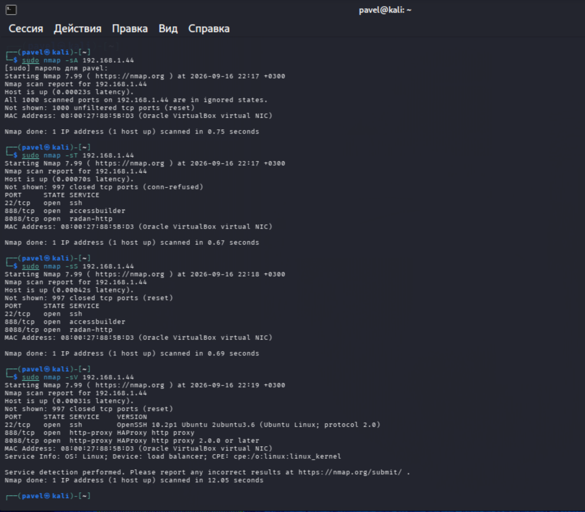
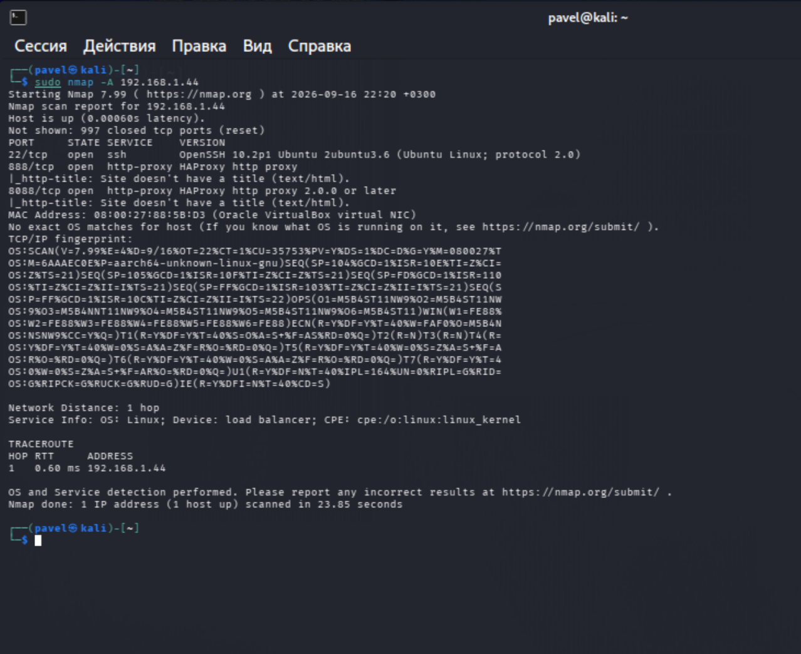

**Логи Suricata**
В /var/log/suricata/fast.log зафиксированы события:
- ET SCAN Possible Nmap User-Agent Observed — Suricata распознала характерный User-Agent Nmap.
- SURICATA HTTP request field missing colon — аномалии HTTP-запросов от Nmap.
- SURICATA Ethertype unknown — шумовые пакеты (ARP).

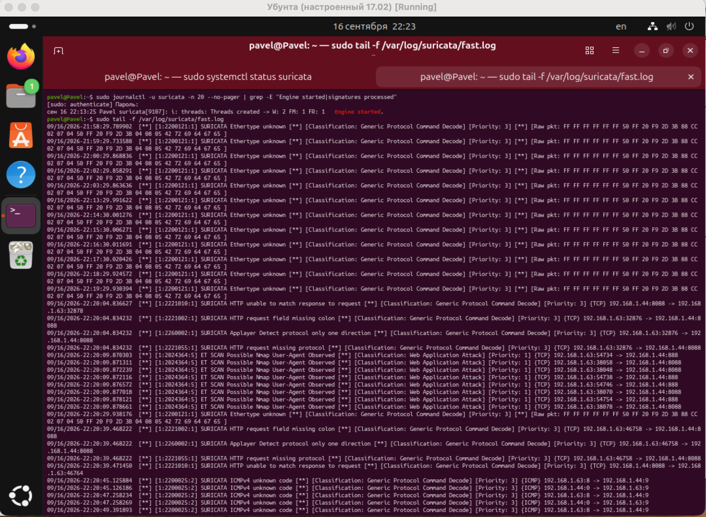
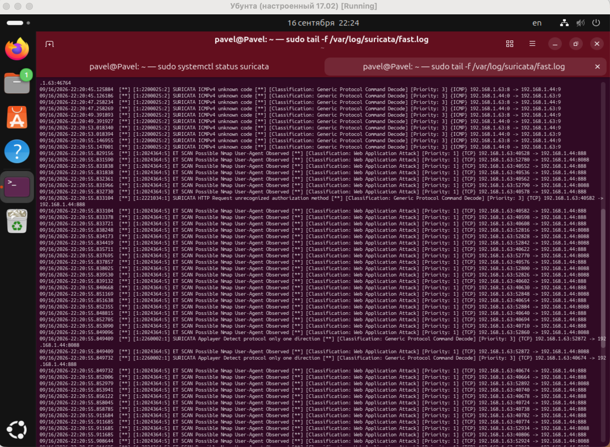
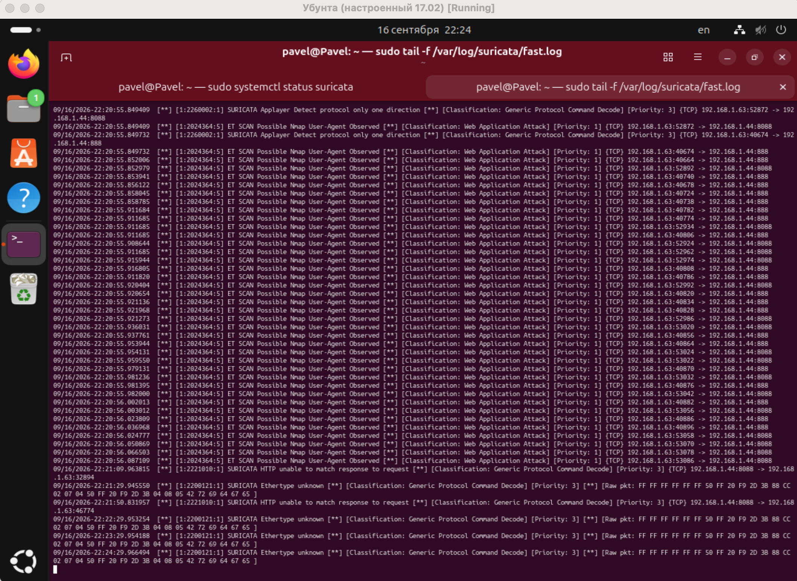

**События в логах Fail2Ban**
За период Nmap-сканирования события в /var/log/fail2ban.log отсутствуют. Это подтверждает, что Fail2Ban не реагирует на сканирование портов — его фильтры анализируют только логи неудачных попыток аутентификации.
Для фиксации результатов работы Fail2Ban сканирование выполнялось повторно.

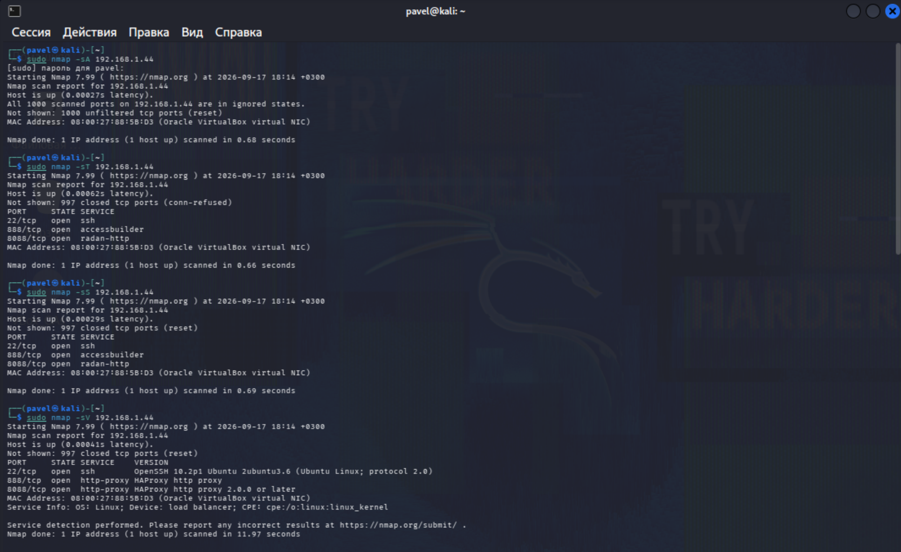
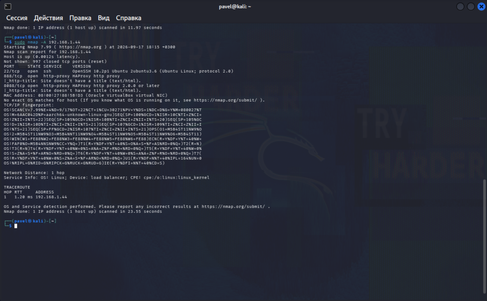
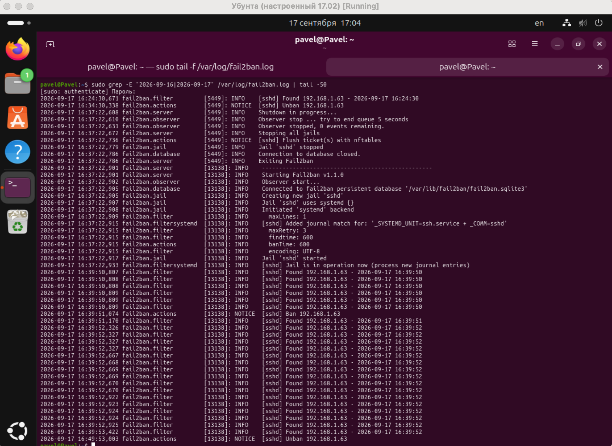

**Выводы**
Разведка прошла успешно: обнаружены открытые порты SSH и HAProxy. Suricata зафиксировала активность сканирования, Fail2Ban не сработал, так как сканирование не является попыткой входа.

## Задание 2
Проведите атаку на подбор пароля для службы SSH:
`hydra -L users.txt -P pass.txt < ip-адрес > ssh`
Настройка hydra:
- создайте два файла: users.txt и pass.txt;
в каждой строчке первого файла должны быть имена пользователей, второго — пароли. В нашем случае это могут быть случайные строки, но ради эксперимента можете добавить имя и пароль существующего пользователя.
Дополнительная информация по hydra: https://kali.tools/?p=1847.
Включение защиты SSH для Fail2Ban:
- открыть файл /etc/fail2ban/jail.conf,
- найти секцию ssh,
- установить enabled в true.
Дополнительная информация по Fail2Ban:https://putty.org.ru/articles/fail2ban-ssh.html.
В качестве ответа пришлите события, которые попали в логи Suricata и Fail2Ban, прокомментируйте результат.

### Решение 2
**Атака Hydra без защиты**
На Kali созданы файлы users.txt (логины) и pass.txt (пароли, включая реальный пароль пользователя pavel).
Выполнена команда:
```bash
sudo hydra -L users.txt -P pass.txt ssh://192.168.1.44
```
Результат: пароль пользователя pavel подобран успешно:
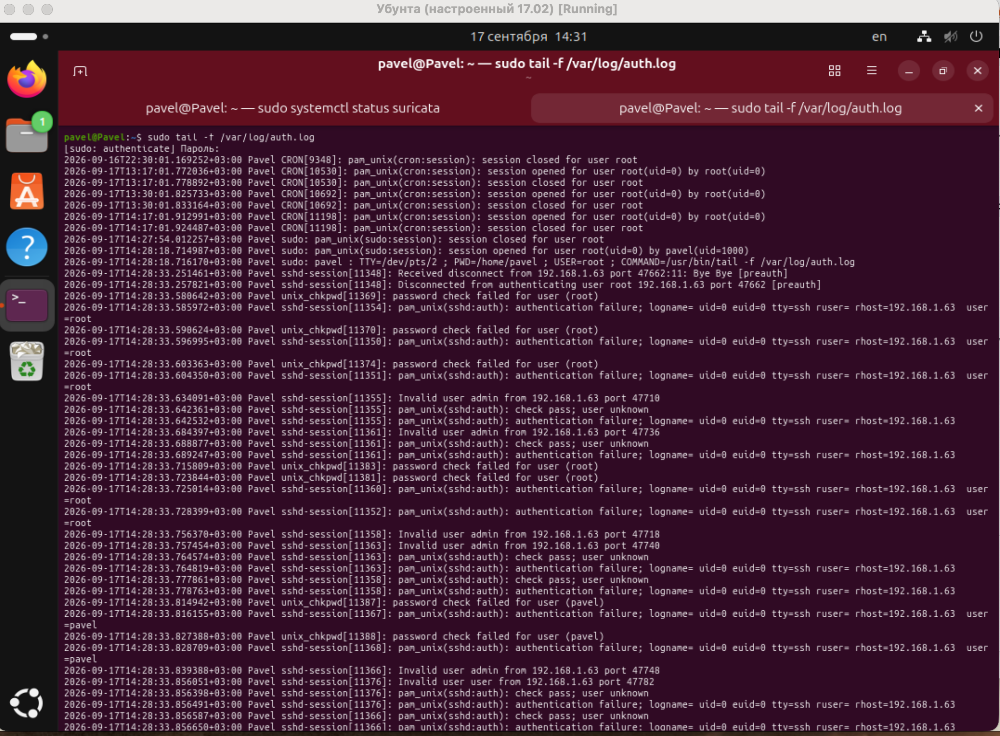
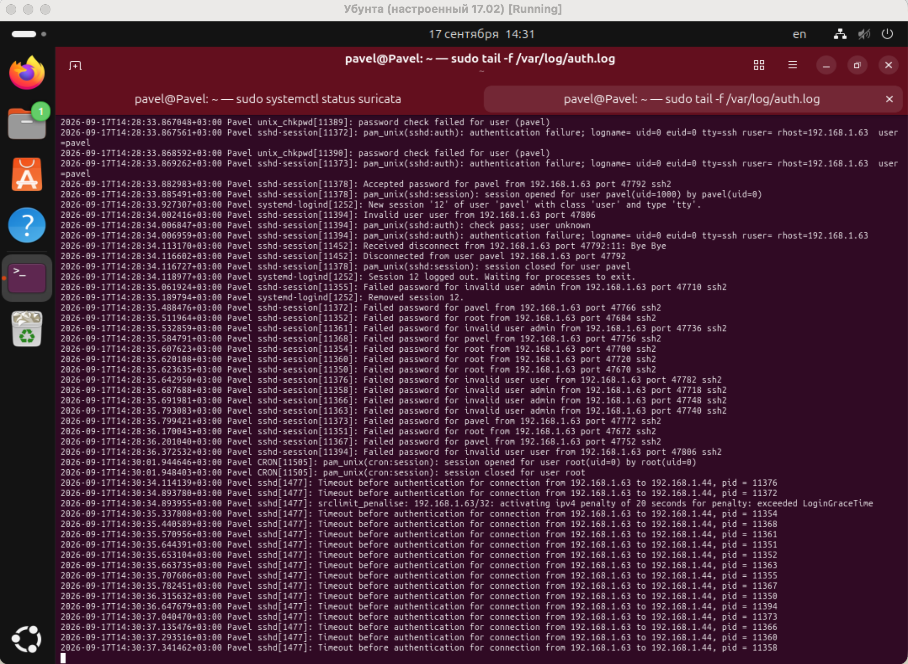

**Настройка Fail2Ban**
Создан файл /etc/fail2ban/jail.local:
```ini
[DEFAULT]
backend = systemd
bantime = 600
findtime = 600
maxretry = 3

[sshd]
enabled = true
port = ssh
filter = sshd
backend = systemd
logpath = /var/log/auth.log
maxretry = 3
findtime = 600
bantime = 600
```

**Повторная атака и результат**
После повторного запуска hydra Fail2Ban забанил IP Kali:
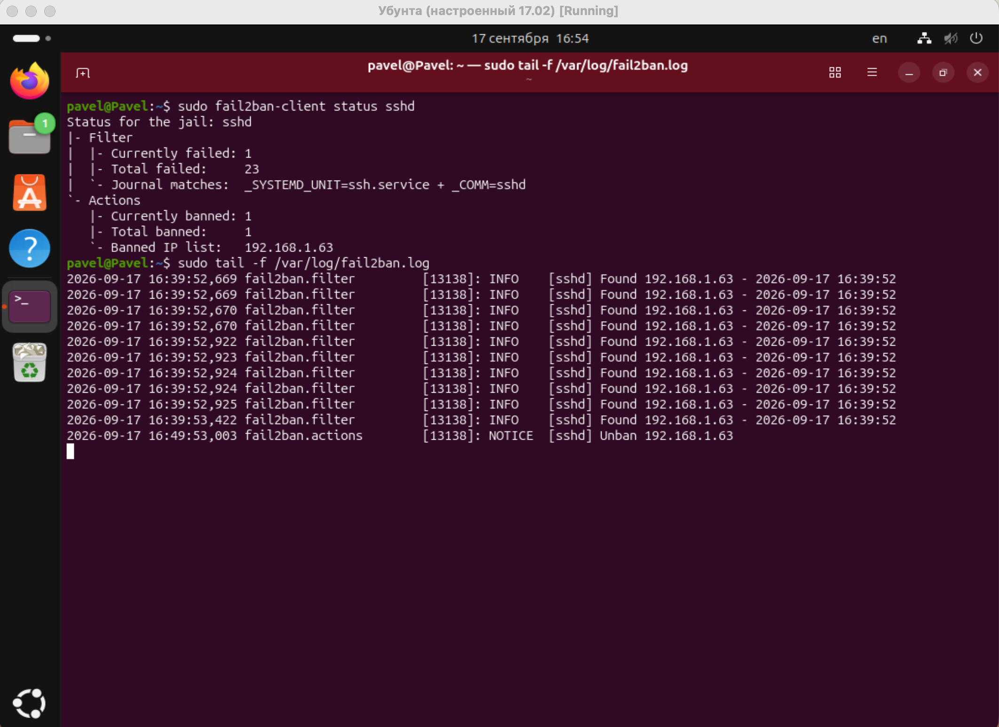

**Логи Suricata во время атаки Hydra**
В /var/log/suricata/fast.log зафиксированы события:
- SURICATA SSH invalid banner — множественные некорректные SSH-подключения.
- SURICATA STREAM excessive retransmissions — перегрузка TCP из-за параллельных подключений Hydra.
- SURICATA AppLayer Detect protocol only one direction — обрывы SSH-сессий.

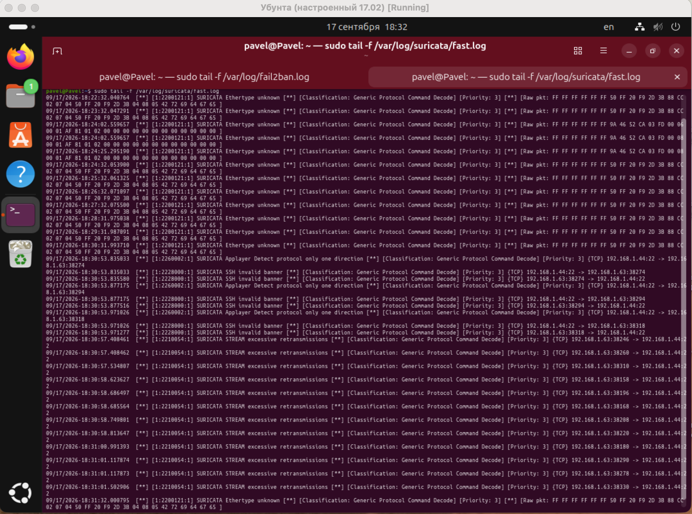

**Выводы**
Без Fail2Ban Hydra успешно подобрала пароль SSH. После настройки Fail2Ban IP-адрес атакующей системы был автоматически заблокирован после 3 неудачных попыток.